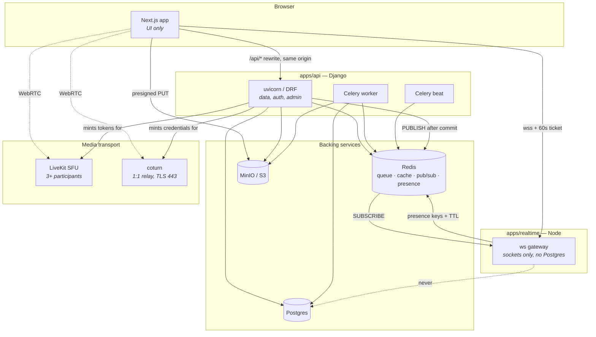
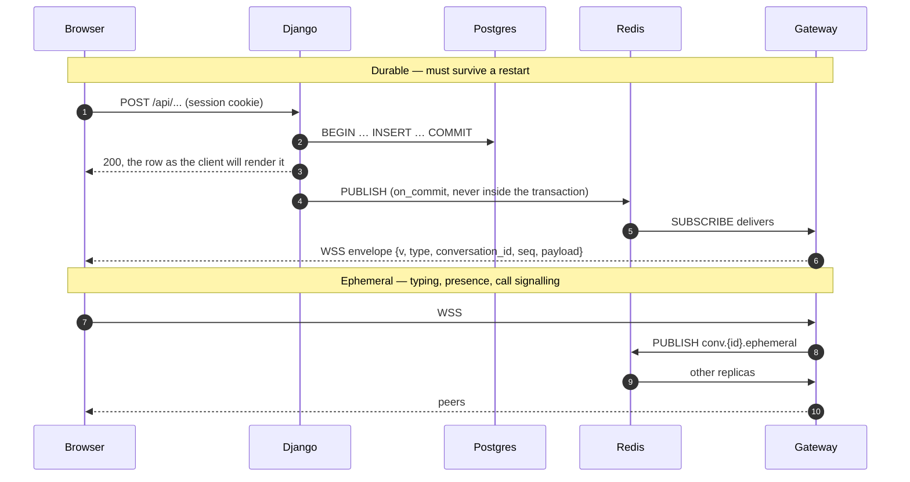

# Aperture — Architecture

A photo and video social platform. Web only. Local-first, scales without a rewrite.

**Django owns the data and the API. Node owns the sockets. Next.js owns the UI.** Three deployables, one repo.

**Design rule:** every local component speaks the same protocol as its production replacement. MinIO is S3's API, so Cloudflare R2 is an env var. Self-hosted LiveKit is LiveKit Cloud's API. Postgres is Postgres. You never rewrite to scale — you swap the endpoint.

> **Versions live in [`docs/VERSIONS.md`](docs/VERSIONS.md)**, verified against PyPI and npm and pinned. Use those, not numbers from memory.

---

## 1. Stack

**Backend — Python / Django**

| Concern        | Package                                                           |
| -------------- | ----------------------------------------------------------------- |
| Runtime        | CPython                                                           |
| Framework      | Django                                                            |
| API            | Django REST Framework                                             |
| Schema / types | drf-spectacular (OpenAPI 3.1)                                     |
| Database       | PostgreSQL via psycopg 3                                          |
| ORM            | Django ORM                                                        |
| Auth           | Django auth (session cookies, same-site)                          |
| Queues         | Celery + Redis broker                                             |
| Realtime       | **publishes to Redis; does not hold sockets**                     |
| ASGI server    | uvicorn                                                           |
| Images         | Pillow → Cloudflare Images                                        |
| Video          | ffmpeg subprocess → Mux                                           |
| Object storage | boto3 → MinIO → Cloudflare R2                                     |
| SFU tokens     | livekit-api                                                       |
| Admin          | Django admin + **django-unfold** — the Phase 5 moderation console |
| Tests          | pytest-django                                                     |
| Lint / types   | ruff + mypy + django-stubs                                        |
| Packages       | uv                                                                |

**Realtime — TypeScript / Node**

| Concern             | Package                      |
| ------------------- | ---------------------------- |
| Runtime             | Node.js (LTS)                |
| Sockets             | `ws`                         |
| Fanout              | ioredis (pub/sub)            |
| Ticket verification | `jose` (HS256)               |
| Event schemas       | Zod, shared with the browser |

**Frontend — TypeScript / Next.js**

| Concern    | Package                                       |
| ---------- | --------------------------------------------- |
| Framework  | Next.js (App Router, Turbopack)               |
| UI runtime | React + React Compiler                        |
| Styling    | Tailwind CSS (CSS-first `@theme`)             |
| Components | shadcn/ui on **Base UI**                      |
| Motion     | Motion (ex Framer Motion)                     |
| API client | openapi-typescript + openapi-fetch, generated |
| Validation | Zod (forms and client-side only)              |
| Realtime   | native WebSocket to `apps/realtime`           |
| Calls      | livekit-client                                |
| Tests      | Vitest, plus flows walked in Chrome           |
| Packages   | pnpm                                          |

Two notes on shadcn. New projects scaffold on **Base UI** rather than Radix — take that default, it's where the registry is heading. And the registry ships **chat primitives** (`MessageScroller`, `Message`, `Bubble`, `Attachment`), which covers a real chunk of Phase 6.

**Why Django here:** the admin gives us the Phase 5 moderation console essentially for free, and Django's ORM, auth, and migrations are the most mature in any ecosystem. **What it costs:** the type boundary in §3, which you must automate on day one or it will rot.

**Why sockets are in Node:** concurrent connection density. A Python process holds roughly 1–5k WebSocket connections; a Node process holds 10–50k. Sockets are also the most cleanly separable part of the system — the service holds no business logic and never touches the database — so putting them in the runtime that's good at them costs one small service and buys the whole realtime ceiling. This is the same split Instagram made: their Django monolith serves the API, and Direct messaging runs on separate infrastructure.

---

### The shape of it

Three deployables, four backing services, one browser. Everything below is a
consequence of the ownership line at the top of this document.



The dashed `never` edge is the rule §8 is built on, drawn so that adding it
looks like what it is.

**The gateway learns nothing from Postgres.** It is told by Redis, and what it
is told was written by Django inside a committed transaction.

---

## 2. Repo layout

```
aperture/
├── apps/
│   ├── api/                    Django project — the entire backend
│   │   ├── config/             settings, urls, asgi.py, celery.py, broadcast
│   │   ├── core/               domain logic — pure Python, NO django imports
│   │   ├── users/              accounts, follows, blocks, presence reads
│   │   ├── media/              upload intent, derivatives, Celery tasks
│   │   ├── posts/              posts, reposts, likes, comments, feed
│   │   ├── stories/            expiring frames, views, reactions, replies
│   │   ├── notifications/      one row per thing that happened to you
│   │   ├── counters/           the counts nothing is allowed to COUNT(*)
│   │   ├── links/              Open Graph previews, SSRF-guarded
│   │   ├── messaging/          conversations, messages, ticket minting
│   │   ├── calls/              LiveKit token minting
│   │   ├── moderation/         reports, unfold admin, rate limits
│   │   └── pyproject.toml
│   ├── realtime/               Node WebSocket gateway — NO database access
│   └── web/                    Next.js frontend
├── packages/
│   ├── api-client/             GENERATED from OpenAPI — never hand-edited
│   ├── realtime-events/        Zod schemas for ephemeral events, shared Node ↔ browser
│   └── ui/                     design system: tokens, primitives, motion
├── infra/
│   ├── docker-compose.yml
│   ├── coturn/turnserver.conf
│   └── livekit/livekit.yaml
├── pnpm-workspace.yaml
└── turbo.json
```

**Three processes.** Two share the Django codebase; the third is a separate Node service.

| Process  | Command                           | Language   | Scales on          |
| -------- | --------------------------------- | ---------- | ------------------ |
| API      | `uvicorn config.asgi:application` | Python     | request rate       |
| Worker   | `celery -A config worker`         | Python     | queue depth        |
| Realtime | `node apps/realtime`              | TypeScript | concurrent sockets |

API and worker share models and settings but deploy independently. Realtime shares nothing but Redis — see §8.

**Why `core/` imports no Django:** it's the only way the business logic stays testable in milliseconds without a database, and portable if Django changes its mind about something. Feed ranking, snowflake generation, the celebrity threshold, permission arithmetic — all pure functions there. If a module in `core/` needs `django.`, it belongs in an app instead.

### Every Django app has the same shape

Not a suggestion — the same eight files, in the same order, in every app. Someone opening `posts/` should already know where things are from having read `users/`.

```
posts/
├── models.py         data only. No business logic, no queries beyond properties.
├── selectors.py      READS. Every query lives here and returns querysets.
├── services.py       WRITES. Business transactions. The only place .save() is called.
├── serializers.py    DRF shapes. No logic.
├── views.py          thin. Parse request → call a selector or service → return.
├── urls.py
├── admin.py          unfold ModelAdmin
├── tasks.py          Celery
└── tests/            test_selectors.py, test_services.py, test_views.py
```

`models.py` past ~300 lines becomes a `models/` package, one module per aggregate. Same for selectors and services.

**Why selectors and services rather than fat models or fat views** — three of the rules in this document become mechanically checkable instead of aspirational:

- **Block filtering** (§11) lives in one selector helper. "Every read path filters blocks" becomes "every read goes through a selector, and the base selector filters blocks." You audit one file, not forty views.
- **Publish-after-commit** (§8) lives in services. There is exactly one place a message is written, so there is exactly one place the publish can be wrong.
- **No `.count()` on a request path** (§11) is greppable when every query is in a file named `selectors.py`.

A view that queries the ORM directly, or a serializer containing an `if`, is the smell. Move it.

### Import direction is one-way

```
core/  ←  apps/  ←  views
  (never imports apps)      apps never import each other's internals —
                            only each other's selectors and services
```

`packages/ui` never imports from `apps/web`. `apps/web` imports `packages/api-client` and `packages/ui`, never the reverse. `apps/realtime` imports `packages/realtime-events` and nothing else from the repo.

A cycle between two Django apps means the boundary is in the wrong place. Fix the boundary; do not add a local import to silence it.

### And the frontend

```
apps/web/src/
├── app/
│   ├── (auth)/       login, signup — no nav chrome
│   ├── (app)/        authenticated shell — feed, profile, messages, settings
│   └── layout.tsx
├── features/         one folder per domain: feed/, post/, profile/, messages/
│   └── feed/         components + hooks for that feature, colocated
├── lib/
│   ├── api.ts        the openapi-fetch client, configured once
│   └── realtime.ts   the socket client, configured once
└── hooks/            cross-feature only
```

**`packages/ui` is the design system: tokens, primitives, motion. Nothing that knows what a post is.** Feature components live in `apps/web/features/`. The test is whether a component would make sense in a different product — `Button` and `DevelopImage` would, `PostCard` would not.

Route groups do the work that a `Layout` boolean prop otherwise would: `(auth)` has no nav rail, `(app)` has the three-column shell from the design spec.

### Bootstrap with the official CLIs

Do not hand-write scaffolding that a generator produces. Canonical structure, current defaults, no invented boilerplate:

| What            | Command                                                                     |
| --------------- | --------------------------------------------------------------------------- |
| Monorepo        | `pnpm dlx create-turbo@latest`                                              |
| Django project  | `uv init` → `uv add django` → `uv run django-admin startproject config .`   |
| Each Django app | `uv run manage.py startapp <name>`                                          |
| Next.js         | `pnpm create next-app@latest` (TypeScript, Tailwind, App Router, `src/`)    |
| shadcn          | `pnpm dlx shadcn@latest init` then `pnpm dlx shadcn@latest add <component>` |
| Python deps     | `uv add <pkg>` — never hand-edit `pyproject.toml` dependencies              |
| JS deps         | `pnpm add <pkg>` — never hand-edit `package.json` dependencies              |

**`pnpm dlx`, not `npx`** — npm is unreliable on this machine, see `docs/VERSIONS.md`.

Then adapt what the generator produced to the layout above. Generated code is a starting point, not a constraint: delete the demo routes, the boilerplate CSS, and the placeholder assets in the same commit that creates them.

---

## 3. The type boundary — read this before Phase 1

Django and the browser are different languages. The contract between them is generated, never hand-written:

```
Django models + DRF serializers
   → drf-spectacular  → openapi.json          (make schema)
   → openapi-typescript → packages/api-client (pnpm generate)
   → Next.js imports typed routes, params, responses
```

**Three rules, all enforced in CI:**

1. `packages/api-client` is **generated output**. Never hand-edit it. It's committed so the frontend builds without a running backend, and CI regenerates and fails on any diff.
2. **A serializer change that isn't reflected in a regenerated client is a broken build**, not a runtime surprise. This is the whole point.
3. Zod lives on the **frontend only** — form validation and user input. It does not restate the API contract; the generated types do that. Two hand-maintained descriptions of the same shape is the failure mode this section exists to prevent.

This is the one thing the TypeScript-everywhere alternative gave for free. Automate it in Phase 1 and it stays cheap forever. Defer it and every phase after pays interest.

**Socket payloads ride the same contract.** When Django publishes a message event, the payload is the output of _the same DRF serializer_ the REST endpoint returns — so its type is already in the OpenAPI schema and already in the generated client. Only the envelope is hand-typed, and it is five fields:

```ts
{ v: 1, type: "message.created", conversation_id: string, seq: number, payload: unknown }
```

Ephemeral events (typing, presence) never involve Python at all — they're Node-to-browser, both TypeScript, so `packages/realtime-events` holds one Zod schema that both ends import. **There is no third hand-maintained description of anything anywhere.** If you find yourself writing a TypeScript interface that restates a Django serializer, stop: that's the failure mode this section exists to prevent.

**Auth flows through the same origin.** Next.js rewrites `/api/*` to Django, so the browser sees one origin and Django's session cookie is same-site. No JWT in `localStorage`, no CORS credential dance. Configure the rewrite in Phase 1 and CSRF works the way Django expects.

---

## 4. Local environment

```yaml
# infra/docker-compose.yml
services:
  postgres:
    image: postgres:18-alpine
    environment:
      POSTGRES_USER: app
      POSTGRES_PASSWORD: devpassword
      POSTGRES_DB: aperture
    ports: ["5433:5432"] # host 5432 is taken by a native PG service — see docs/VERSIONS.md
    volumes: [pgdata:/var/lib/postgresql/data]
    healthcheck:
      test: ["CMD-SHELL", "pg_isready -U app"]
      interval: 5s

  redis:
    image: redis:8-alpine
    command: redis-server --appendonly yes
    ports: ["6379:6379"]
    volumes: [redisdata:/data]

  minio:
    image: minio/minio:RELEASE.2025-09-07T16-13-09Z
    command: server /data --console-address ":9001"
    environment:
      MINIO_ROOT_USER: minioadmin
      MINIO_ROOT_PASSWORD: minioadmin
    ports: ["9000:9000", "9001:9001"]
    volumes: [miniodata:/data]

  minio-init:
    image: minio/mc
    depends_on: [minio]
    entrypoint: >
      /bin/sh -c "
      mc alias set local http://minio:9000 minioadmin minioadmin;
      mc mb --ignore-existing local/media;
      mc mb --ignore-existing local/dm-media;
      mc anonymous set download local/media;
      "

  livekit:
    image: livekit/livekit-server:v1.13.5
    command: --config /etc/livekit.yaml --node-ip=127.0.0.1
    ports: ["7880:7880", "7881:7881", "50000-50100:50000-50100/udp"]
    volumes: [./livekit/livekit.yaml:/etc/livekit.yaml]

  coturn:
    image: coturn/coturn:4.17.2
    network_mode: host
    volumes: [./coturn/turnserver.conf:/etc/coturn/turnserver.conf]

  typesense:
    image: typesense/typesense:28.0
    profiles: ["search"]
    environment:
      TYPESENSE_API_KEY: devkey
      TYPESENSE_DATA_DIR: /data
    ports: ["8108:8108"]
    volumes: [typesensedata:/data]

volumes: { pgdata, redisdata, miniodata, typesensedata }
```

`docker compose up`, then `uv run manage.py runserver` and `pnpm dev` — the current stack from a cold machine in about four minutes. Start Docker Desktop first; it does not auto-start on this machine. Typesense stays behind `--profile search` until the 100k→1M stage where this document introduces it.

---

## 5. Schema

Django models and migrations. The table design below is the decision; the ORM is just how it's spelled.

**Snowflake IDs, not UUIDv4.** 64-bit, time-sortable, generated in `core/`. `ORDER BY id` _is_ `ORDER BY created_at`, cursor pagination is trivial, and index locality survives. Use a `BigIntegerField(primary_key=True)` with a default from `core.ids.snowflake` — **not** `BigAutoField`, because the point is that the application owns the value. If you must use UUID, use **v7** — never v4 as a primary key on a table heading for hundreds of millions of rows.

```
users                                  -- extends AbstractUser
  id, username (citext unique), email, display_name, avatar_media_id,
  bio, is_private, created_at
  -- no counts here; see counters

follows
  follower_id, followee_id, status('accepted'|'pending'), created_at
  PK (follower_id, followee_id)
  INDEX (followee_id, follower_id)     -- "who follows me"
  -- both directions indexed, or one of the two queries is a seq scan

blocks
  blocker_id, blocked_id, created_at
  PK (blocker_id, blocked_id)
  INDEX (blocked_id)                   -- enforced in EVERY read path

media
  id, owner_id, kind('image'|'video'), bucket, object_key,
  width, height, duration_ms, blurhash, dominant_color,
  state('pending'|'ready'|'failed')
  -- row exists BEFORE upload completes; worker flips to ready
  -- dominant_color feeds the UI's ambient glow, see design spec

posts
  id, author_id, caption, location, visibility, created_at, deleted_at,
  reposted_from_id,                    -- self-FK; NULL for an original
  link_preview_id
  INDEX (author_id, id DESC)                    -- profile contact sheet
  INDEX (id DESC) WHERE deleted_at IS NULL      -- Django: condition= on Index
  -- A repost is a post, not a second model: it appears in feeds, is paginated
  -- by the same cursor query and deletes through the same path. The chain is
  -- flattened on write, so reposted_from_id never points at another repost.
  -- Likes and comments belong to the ORIGINAL — forking a conversation into
  -- one thread per repost, each invisible from the others, is the failure
  -- mode this avoids. A repost row's own like/comment counters stay at zero.

post_media    post_id, media_id, position       -- carousels

likes
  user_id, post_id, created_at
  PK (post_id, user_id)                -- post_id first: "who liked this"
  INDEX (user_id, created_at DESC)

comments
  id, post_id, author_id, parent_id, body, created_at, deleted_at
  INDEX (post_id, id)

counters
  entity_type, entity_id, metric, value
  PK (entity_type, entity_id, metric)
  -- metric: followers|following|posts|likes|comments|replies|reposts|shares
  -- Celery-updated, Redis-cached. NEVER .count() on a hot path.

stories
  id, author_id, media_id NULL, text, background, caption,
  link_preview_id, created_at, expires_at, deleted_at
  CHECK (media_id IS NOT NULL OR text <> '')   -- no empty frames, ever
  -- expires_at is a COLUMN, not a job. Filtered on every read, so a story is
  -- gone the instant it lapses whether or not a worker is running.

story_views        id, story_id, user_id, created_at   UNIQUE (story_id, user_id)

story_reactions
  id, story_id, user_id, emoji, created_at
  UNIQUE (story_id, user_id)           -- reacting again REPLACES
  -- A row rather than a counter, for the same reason story_views is one: the
  -- author wants to know who, and a reaction can be taken back.

notifications
  id, recipient_id, actor_id, verb, detail,
  post_id NULL, comment_id NULL, story_id NULL,
  read_at NULL, created_at
  INDEX (recipient_id, id DESC)
  INDEX (recipient_id, read_at)
  UNIQUE (recipient_id, actor_id, verb, post_id)
         WHERE post_id IS NOT NULL AND comment_id IS NULL
  -- Five nullable FKs, deliberately NOT a GenericForeignKey: a GFK costs a
  -- join per row and cannot be select_related, and this list is read
  -- constantly. The partial unique makes a like idempotent — a double tap is
  -- one row — while leaving comments free to repeat, because two comments
  -- genuinely are two pieces of news.

timeline                               -- push fanout, Phase 8 only
  user_id, post_id, author_id, score, created_at
  PK (user_id, post_id)
  INDEX (user_id, created_at DESC)
```

Composite primary keys need `constraints = [UniqueConstraint(...)]` plus a surrogate, or Django 6's composite primary key support — pick one in Phase 1 and be consistent. Partial indexes go through `Index(condition=Q(deleted_at__isnull=True))`.

Messaging:

```
conversations
  id, kind('dm'|'group'), title, created_at, last_message_seq

conversation_members
  conversation_id, user_id, role, joined_at, last_read_seq, muted_until
  PK (conversation_id, user_id)
  INDEX (user_id)                      -- inbox

messages
  conversation_id, seq BIGINT,         -- server-assigned, monotonic per convo
  id, sender_id, body, media_id,
  client_id UUID,                      -- idempotency key from client
  reply_to_seq,                        -- what this answers, in-thread
  shared_post_id NULL,                 -- a post sent into the room: "reshare"
  replied_story_id NULL,               -- a story answered: "story reply"
  created_at, deleted_at
  PK (conversation_id, seq)
  UNIQUE (conversation_id, client_id)

message_hidden
  id, message_id, user_id, created_at
  UNIQUE (message_id, user_id)
  -- "Delete for me". A row rather than a flag on the message, because the
  -- message is shared and the decision is not — and rather than an actual
  -- delete, because seq has to stay DENSE. A hole in seq is a client that
  -- believes it missed something forever. Filtered in the read path, next to
  -- the block filter, for the same reason.
```

**Deleting for everyone and deleting for yourself are different operations**
and this is where that is decided. The first sets `messages.deleted_at` and
requires the message to be yours; the second writes a `message_hidden` row and
works on anybody's, changing nothing that anybody else sees. They are two
service functions and two controls, never one with a flag — a flag between two
operations that differ in _who they affect_ is a flag that eventually gets
passed wrong.

A story reply is a direct message and nothing else: no second inbox, no second
unread count, no second delivery path. `replied_story_id` is only the context
that tells the author which of four frames was answered.

That `seq` column and that `UNIQUE` constraint are the two most important lines in the entire schema. `seq` gives correct ordering without trusting browser clocks, plus cursor sync (_"send me everything after 4821"_) for free. The unique constraint makes a flaky-network retry a no-op instead of a duplicate message. Both are miserable to retrofit onto live conversations.

Only Django writes these tables. `apps/realtime` reads none of them — it learns about a new message from Redis, not from Postgres.

Allocate `seq` inside the same transaction as the insert, with a row lock:

```python
with transaction.atomic():
    conv = Conversation.objects.select_for_update().get(pk=conversation_id)
    conv.last_message_seq += 1
    conv.save(update_fields=["last_message_seq"])
    Message.objects.create(conversation=conv, seq=conv.last_message_seq, ...)
```

Correct order, no gaps. Catch `IntegrityError` on the `client_id` unique constraint and return the existing message — that is the whole idempotency story.

---

## 6. Media pipeline

Bytes never pass through your server. Not at any scale — develop against the same path you'll ship.

```
1. POST /api/media/intent { kind, mime, size }
   → create media row (state=pending)
   → boto3 generate_presigned_url('put_object') + media_id
2. Browser PUTs directly to MinIO / R2
3. POST /api/media/:id/complete → Celery task
4. Worker: ffprobe → validate → blurhash + dominant color
   images: Pillow derivatives | video: ffmpeg locally, Mux in prod
   → state = ready
5. Client polls (Phase 3) or receives a WS event (Phase 6); image develops in
```

Presigned URLs: 5-minute expiry, constrained on content-length and content-type. An unconstrained presigned URL is a free file host for anyone who finds it.

Validate the _file_, not the client's claim: `ffprobe` for video, Pillow's `Image.verify()` plus `python-magic` for images. A declared `image/jpeg` that is really something else is the first upload attack you'll see.

**Do not build a video transcoding pipeline.** One ffmpeg subprocess producing 720p H.264 is fine locally. In production, hand video to Mux. Adaptive bitrate ladders, HLS packaging, per-device codec selection — a genuine multi-quarter project, and not your product.

**Pillow is the starting choice; `pyvips` is the upgrade.** pyvips is several times faster on large images but needs a system library. Start on Pillow and swap only if the worker becomes the bottleneck — the derivative code is the same shape either way.

---

## 7. Feed

Everything else here is plumbing. This is architecture.

**Phase 1 — pull.** Query at read time:

```sql
SELECT p.* FROM posts p
JOIN follows f ON f.followee_id = p.author_id
WHERE f.follower_id = $1 AND f.status = 'accepted'
  AND p.deleted_at IS NULL
  AND NOT EXISTS (SELECT 1 FROM blocks b
                  WHERE b.blocker_id = $1 AND b.blocked_id = p.author_id)
  AND p.id < $2
ORDER BY p.id DESC LIMIT 30;
```

Always fresh, trivially correct, no invalidation bugs. Good into the low millions of posts given both `follows` indexes. **Start here and don't apologize for it.**

Express it with the ORM, but **read the generated SQL** — `.explain()` on this query at least once in Phase 4. The ORM makes it easy to write something that looks identical and produces a very different plan. Use `select_related`/`prefetch_related` deliberately; the N+1 that the ORM hides from you is the single most common way a Django feed gets slow.

**Phase 2 — cache.** Redis sorted set per user, 30-min TTL, invalidated on a followee's new post.

**Phase 3 — hybrid push.** Only when feed p99 crosses ~200ms. New post → Celery task → write into every follower's `timeline`, _except_ accounts over ~10k followers, which stay pull and merge in at read time.

The split is arithmetic, not taste: pure push means a 10M-follower account triggers 10M writes per post; pure pull means someone following 5,000 accounts triggers a brutal fan-in on every scroll. Instagram and Twitter both converged here. Don't build it speculatively — instrument, then act.

---

## 8. Realtime

`apps/realtime` is a Node service running `ws`, with Redis pub/sub for cross-replica fanout.

**The one rule that keeps this simple: the realtime service never touches Postgres.** It holds no models, no migrations, no ORM, no business logic. It is a socket gateway — it authenticates a connection, subscribes it to Redis channels, and pushes bytes. Everything durable belongs to Django. Break that rule and you have two applications fighting over one schema, which is far worse than the problem you were solving.

### Two classes of event, two paths



**Persisted events** — messages, reactions, read receipts. These go **up over HTTP** to Django and come **down over the socket**:

```
Browser ──POST /api/conversations/{id}/messages──> Django
                                                     │ allocates seq, writes PG,
                                                     │ idempotent on client_id
                                                     ▼
                                            PUBLISH conv.{id}  (Redis)
                                                     │
Browser <────── WSS ────── apps/realtime replica ◄───┘
```

Writes go over HTTP because the write must be transactional — `seq` allocation and `client_id` idempotency happen in one Postgres transaction that only Django can run. Sending over the socket would mean Node forwarding to Django anyway: an extra hop for nothing. It also means _send message_ is a typed call in the generated API client, and optimistic UI hides the round trip completely.

**Ephemeral events** — typing, presence, call signaling. These go **up over the socket** and never reach Django or Postgres at all:

```
Browser ──WSS──> realtime ──PUBLISH conv.{id}.ephemeral──> other replicas ──WSS──> peers
```

Nothing here is worth a database write or an HTTP request per keystroke. Presence is Redis keys with a TTL, refreshed by heartbeat.

That split is the whole design. **If an event must survive a restart it goes through Django; if it doesn't, it stays in Node.**

### The durable event types

Two channel shapes. `conv.{id}` addresses a room; `user.{id}` addresses one
person and is the one a client can neither name nor opt out of, so its
membership is decided entirely by the publisher.

| Type                   | Channel                 | Payload                | Why not more                                                                                                                                                 |
| ---------------------- | ----------------------- | ---------------------- | ------------------------------------------------------------------------------------------------------------------------------------------------------------ |
| `message.created`      | `conv.{id}`             | the serialised message | it is the message; the client renders it directly                                                                                                            |
| `message.read`         | `conv.{id}`             | reader id, seq         |                                                                                                                                                              |
| `message.deleted`      | `conv.{id}`             | seq                    |                                                                                                                                                              |
| `post.created`         | `user.{id}` × followers | post id, author id     | ids only — the feed applies visibility, blocks and privacy, and a payload carrying the post would need every one of those checks re-implemented for the wire |
| `story.created`        | `user.{id}` × followers | story id, author id    | same                                                                                                                                                         |
| `notification.created` | `user.{id}`             | the verb               | same; the client refetches the list, which is the only place blocks are applied                                                                              |

**The list is closed on both sides.** `packages/realtime-events` holds the same
enum the publisher does, and the client drops what it does not recognise — so a
type published but not listed there simply never arrives. That is the worst
kind of bug to go looking for, which is why the enum is shared rather than
duplicated.

Fanout is capped at `MAX_RECIPIENTS` (5,000) per publish. A very large account's
followers do not all get a live update; they get it on their next fetch, which
is what everyone got before any of this existed. The alternative is a fanout
worker, which §7 puts behind a measurement nobody has taken yet.

### Presence, and the two keys

The gateway owns presence because it is the only process that can observe it.
It writes `presence:{user_id}` with a 75-second TTL, refreshed on heartbeat,
and `last-seen:{user_id}` with **no** TTL — the point of "last seen" is that it
outlives the thing saying you are here.

Django reads both and writes neither. `users/presence.py` batches into one
`MGET` and **fails closed to "nobody is online"**: a Redis hiccup that reported
everyone online would put a live dot next to people who are not there, which is
worse than a dot briefly missing.

### Authentication

Django mints a short-lived signed ticket; Node verifies it with a shared secret and never calls back:

1. Browser `POST /api/realtime/ticket` (authenticated by the normal session cookie)
2. Django returns an HS256 JWT — `{sub: user_id, exp: now + 60s}` — signed with `REALTIME_TICKET_SECRET`
3. Browser connects `wss://.../ws?ticket=…`
4. Node verifies the signature with `jose` and the same secret, then drops the ticket

Stateless, no database lookup on connect, and a leaked ticket expires in a minute. The secret is the one thing both services share; it lives in the environment, never in code.

### Scale and reconnect

Add replicas; Redis handles fanout. Comfortably 10k+ sockets per Node process, so a single replica covers a very large early user base. Past Redis pub/sub, move to Redis Streams or NATS — you'll know long before you get there.

Reconnect: client sends `{conversation_id, last_seq}` over the socket, Node calls Django's internal delta endpoint on its behalf — or simpler, the client fetches the delta over HTTP itself and _then_ opens the socket. Prefer the second: it keeps the gateway dumb. Either way it's correct because `seq` is monotonic, and that is the entire offline-sync story.

**Deliver-then-persist is not allowed.** Django publishes to Redis only _after_ the transaction commits. Publishing inside the transaction means a rollback still delivers a message that doesn't exist.

---

## 9. Calls

- **1:1** — WebRTC peer-to-peer, TURN fallback.
- **Group (3+)** — LiveKit SFU. Docker locally, LiveKit Cloud in prod, identical client SDK. Never an MCU; server-side mixing burns a core per call and buys nothing.
- **Signaling** — an ephemeral event class on the existing `apps/realtime` socket (§8). Don't open a second connection, and don't persist offers and answers.
- **Tokens** — minted by Django with `livekit-api`. Never in the browser, never in the Node service.
- **TURN** — coturn with **TLS on 443**, non-negotiable. Egyptian ISPs and effectively every corporate firewall drop UDP. Without TCP/443 fallback your connection rate quietly sits near 70% and you'll blame the code.

Budget TURN bandwidth as a real line item. Every relayed call is full media through your server — the one WebRTC cost that scales linearly with usage.

---

## 10. Scaling path

| Stage      | What changes                                                                               |
| ---------- | ------------------------------------------------------------------------------------------ |
| 0 → 10k    | Nothing. One API process, one worker, one Postgres, pull feed.                             |
| 10k → 100k | Read replica. Redis feed cache. More Celery workers. Video to Mux.                         |
| 100k → 1M  | Hybrid push. Partition `messages` by month. PgBouncer. Typesense. Second realtime replica. |
| 1M → 10M   | Conversations onto their own DB. Citus or app-level shard by user_id.                      |
| 10M+       | You have a platform team; this document is obsolete.                                       |

The most common failure in projects like this is building stage-3 infrastructure at stage 0 — Kafka, sharding, a service mesh for forty users. Each one multiplies the cost of every feature you ship between now and a scale you may never reach.

---

## 11. Non-negotiable from day one

**Moderation.** Public image upload attracts CSAM, spam, and copyright claims within days of traction. This is a legal and ethical obligation from your first public user, not a Phase 9 feature. Minimum: CSAM scanning on the bucket, an NCMEC reporting path, a report queue with an admin view, hard upload rate limits. Build the report button before you build stories. Django admin with **django-unfold** gives you the queue, the row actions, and the permission gating cheaply — see `docs/vendor/django-unfold.md`. There is no excuse to defer this one.

**Blocking.** Enforced at the query layer in _every_ read path — feed, search, comments, DMs, notifications. Retrofitting means auditing every query you've ever written. It's in the Phase 1 feed query above for exactly this reason. Put it in a single reusable queryset method (`visible_to(user)`) so there is one place to audit rather than forty.

**Deletion.** Real account deletion is a GDPR requirement. Soft-delete everywhere plus a scheduled hard-delete task, or you'll write a data-archaeology script under a deadline.

**Rate limits.** Redis token bucket, per-user and per-IP, on upload / follow / comment / message. DRF's built-in throttling is a starting point but is per-view and coarse — the token bucket belongs in `core/` where it can be tested. Follow-spam is the first abuse you will see.
