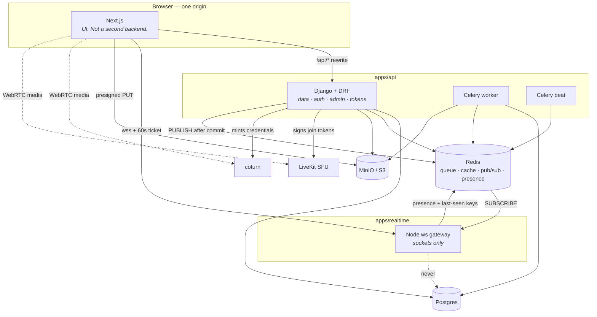

# Aperture

A photo and video social platform. Web only.

**Django owns the data and the API. Node owns the sockets. Next.js owns the
UI.** Three deployables, one repo.

| Doc                                          | Owns                                      |
| -------------------------------------------- | ----------------------------------------- |
| [`01-ARCHITECTURE.md`](01-ARCHITECTURE.md)   | stack, schema, data flow, scaling path    |
| [`02-DESIGN-SYSTEM.md`](02-DESIGN-SYSTEM.md) | color, type, layout, motion               |
| [`03-AGENT-BRIEF.md`](03-AGENT-BRIEF.md)     | process, phases, standing rules           |
| [`docs/VERSIONS.md`](docs/VERSIONS.md)       | pinned versions and this machine's quirks |

---

## What it looks like



Three deployables because they scale on different things: the API on request
rate, the worker on queue depth, the gateway on concurrent sockets. The
`/api/*` rewrite is the **only** integration point between the frontend and the
backend, and it exists so the browser stays on one origin and Django's session
cookie stays same-site.

The dashed `never` edge is a rule, not an omission. A gateway that could read
Postgres would become a second application fighting over one schema.

**Where a change goes:**

| If it…                                       | it belongs in                                         |
| -------------------------------------------- | ----------------------------------------------------- |
| must survive a restart                       | Django — HTTP up, Redis pub/sub down, socket delivers |
| must not (typing, presence, call signalling) | the Node gateway; it never reaches Postgres           |
| is a shape the browser reads                 | a DRF serializer, then `pnpm generate`                |
| is pure arithmetic or a rule                 | `apps/api/core/`, which imports no Django             |

---

## Setup from a clean clone

### 0. Prerequisites

- **Docker Desktop**, started manually — it does not auto-start on this
  machine.
- **[uv](https://docs.astral.sh/uv/)** for Python. `pip`, `poetry` and `pipx`
  are not on PATH and are not needed.
- **pnpm**, not npm. npm is unreliable here; see `docs/VERSIONS.md` for the
  corrupt-junction diagnosis. Use `pnpm dlx` wherever a guide says `npx`.

### 1. Backing services

```bash
cd infra && docker compose up -d
```

Brings up Postgres (host port **5433**), Redis, and MinIO with its two buckets.
Wait for `docker compose ps` to show postgres, redis and minio as `healthy`.

Typesense is reserved for the 100k→1M scaling stage and is not used by the
current Postgres-backed search. Its pinned image is available without making
it an idle everyday dependency:

```bash
cd infra && docker compose --profile search up -d typesense
```

Calls need two more, behind a profile so the everyday case stays small.
coturn needs a certificate first, and it must be one the **browser** trusts —
`mkcert` handles both halves:

```bash
mkcert -install
```

```bash
mkcert -cert-file infra/coturn/certs/fullchain.pem -key-file infra/coturn/certs/privkey.pem localhost 127.0.0.1 ::1
```

```bash
cd infra && docker compose --profile calls up -d
```

LiveKit runs the SFU for group calls; coturn relays 1:1 media when a network
refuses a direct connection, with **TLS on 443** because that is the transport
that survives a firewall dropping UDP.

`mkcert -install` writes a root CA into your trust store — worth understanding
before running, and the only step here that touches the machine rather than
the project. Skip it and everything works except `turns:`, which the browser
will refuse. Run the two mkcert commands **in the same shell** and restart the
browser afterwards; `infra/coturn/turnserver.conf` explains why both matter.
The certificates themselves are git-ignored.

### 2. Install

```bash
pnpm install
```

```bash
cd apps/api && uv sync
```

`uv sync` creates `apps/api/.venv` on CPython 3.13.12, downloading that
interpreter if needed. It does not touch the system Python.

### 3. Environment

```bash
cp .env.example .env.local
```

Every variable has a development default in code, so this step is optional
locally. It is not optional anywhere else.

### 4. Migrate

```bash
cd apps/api && uv run manage.py migrate
```

```bash
cd apps/api && uv run manage.py collectstatic --noinput
```

`collectstatic` is not optional. Django serves static files itself only under
`runserver`; this project runs `uvicorn`, which serves none, and WhiteNoise
reads from `STATIC_ROOT`. Skip it and the admin renders as unstyled HTML.

```bash
cd apps/api && uv run manage.py createsuperuser
```

`createsuperuser` asks for an email first — email is the login credential
here, with username kept unique for profile URLs.

---

## The three processes

Each in its own terminal. There is no single command that starts all three,
deliberately: they scale on different things and deploy independently.

**API** — scales on request rate:

```bash
cd apps/api && uv run uvicorn config.asgi:application --reload --port 8000
```

**Worker** — scales on queue depth:

```bash
cd apps/api && uv run celery -A config worker --loglevel=info --pool=solo
```

`--pool=solo` is a Windows requirement; the default prefork pool does not work
there.

**Realtime gateway** — scales on concurrent sockets:

```bash
cd apps/realtime && pnpm dev
```

**Beat** — the scheduler, for the hard delete and the upload reaper:

```bash
cd apps/api && uv run celery -A config beat
```

**Frontend**:

```bash
cd apps/web && pnpm dev
```

Then open <http://localhost:3000>. The admin is at
<http://localhost:8000/admin>.

Seed a corpus to look at:

```bash
cd apps/api && uv run manage.py seed_demo
```

50 users, 500 posts and a follow graph, signing in as
`seed000@aperture.local` / `seeded-password-1234`. Then time the feed and read
the plan Postgres chose:

```bash
cd apps/api && uv run manage.py bench_feed
```

Sweep the fan-in, which is the variable that decides whether a pull feed
holds — `01-ARCHITECTURE.md` §7 warns that "someone following 5,000 accounts
triggers a brutal fan-in on every scroll":

```bash
cd apps/api && uv run manage.py bench_feed --follows 5000
```

Measured on the development machine at 6,004 users / 120,000 posts / 200,000
follow edges:

| followees | p50     | p95     | p99      |
| --------- | ------- | ------- | -------- |
| 200       | 6.23 ms | 9.01 ms | 10.10 ms |
| 1,000     | 6.32 ms | 9.45 ms | 10.41 ms |
| 3,000     | 6.31 ms | 8.05 ms | 10.47 ms |
| 5,000     | 6.10 ms | 8.50 ms | 10.21 ms |

Flat across a 25× change in fan-in. §7 puts the trigger for hybrid push
fanout at p99 above ~200 ms, so **it is not built** — and that is a
measurement rather than a preference.

The Redis feed cache from §7 phase 2 _is_ built, and is off. Compare the two
before turning it on:

```bash
cd apps/api && uv run manage.py bench_feed --cached
```

At this corpus it is about 2× slower (p50 30.72 ms against 16.13 ms), because
caching post ids rather than rows means Postgres is queried either way — the
Redis round trips add to the total instead of replacing it. That is the
tradeoff that keeps a cache hit correct when a post is deleted or a block
appears. Set `FEED_CACHE_ENABLED=1` when the sweep says the query has grown
past it.

Turbo can drive the JavaScript side of that from the root — `pnpm dev` runs
every package's `dev` task — but the Django processes are usually clearer run
directly.

---

## Checking it works

```bash
curl http://localhost:3000/api/health
```

Served by Django on port 8000, reached through the Next.js `/api/*` rewrite.
That rewrite is the **only** integration point between the frontend and the
backend, and it is what keeps the browser on one origin so Django's session
cookie stays same-site. All three dependencies should report `ok`:

```json
{
  "status": "ok",
  "checks": [
    { "name": "postgres", "status": "ok", "latency_ms": 22.1, "detail": "" },
    { "name": "redis", "status": "ok", "latency_ms": 27.95, "detail": "" },
    {
      "name": "object_storage",
      "status": "ok",
      "latency_ms": 157.22,
      "detail": ""
    }
  ]
}
```

```bash
curl http://localhost:4000/health
```

The gateway's own liveness check, including its current socket count.

```bash
pnpm --filter realtime loadtest
```

How many sockets one gateway process holds before latency degrades. It ramps
in waves, measuring the full client → gateway → Redis → gateway → client round
trip, and stops at the first wave to exceed the budget.

Measured on the development machine (Windows 11, gateway and harness sharing
one box): **14,000 concurrent sockets, p95 23.4 ms, 266 MB RSS, zero
failures**, with latency flat from 250 sockets upward. That is a floor rather
than a ceiling — the run ends because the harness exhausts this machine's
16,384-port ephemeral range, not because the gateway slows down. To push
further, widen the range and re-run:

```bash
netsh int ipv4 set dynamicport tcp start=10000 num=55000
```

### Calls

The media path is verified with **synthetic tracks** rather than a webcam — a
canvas `captureStream` and an oscillator produce real `MediaStreamTrack`s with
no hardware, which is what makes this runnable on a machine with no camera or
in a browser that will not grant one. Paste into the console on any page:

```bash
cat docs/verify-call-media.js
```

Measured on the development machine, two `RTCPeerConnection`s and the ICE
servers from a live `POST /api/calls/start`:

| ICE servers offered | policy      | selected pair     | video                 | audio     |
| ------------------- | ----------- | ----------------- | --------------------- | --------- |
| all                 | default     | `host` / udp      | 590 frames, 239 KB    | 79 KB     |
| all                 | `relay`     | `relay` / udp     | 356 frames, 45 KB     | 48 KB     |
| **`turns:` only**   | **`relay`** | **`relay` / tls** | **416 frames, 52 KB** | **56 KB** |

The last row is the one §9 cares about. With only the `turns:` server offered
and relay-only policy, nothing can connect unless coturn allocates **over TLS
on 443** and forwards every packet — so frames arriving proves the TCP/443
path end to end, with a credential Django minted. That is the transport that
survives a network dropping UDP, and it is the reason the connection rate does
not quietly sit near 70%.

The **SFU branch** is the other half, and it is a different chain: past
`SFU_THRESHOLD` participants a call stops being a mesh and becomes a LiveKit
room. What belongs to this codebase there is everything up to the join —
threshold, room name, and a token Django signs.

```bash
cat docs/verify-sfu.js
```

Measured on the development machine, a three-member group: `mode: "sfu"`, a
409-byte token, and LiveKit answering the signalling socket with a 626-byte
JoinResponse. That last part is the point — LiveKit sends _nothing_ to a
socket whose token it rejects, so a response at all proves `LIVEKIT_API_SECRET`
matches on both sides. A token signed with the wrong secret is well-formed,
looks perfect from Django, and is refused at the door.

**Media, too, on a machine with no camera.** The join is where the token
story ends and the media story starts, and the rest is reachable by lying to
the browser rather than bypassing the app:

```bash
cat docs/verify-sfu-media.js
```

It replaces `getUserMedia` with a canvas `captureStream` and an oscillator, so
`livekit-client` acquires, encodes and publishes real tracks through the
product's own call UI. Then check the far side from the server, because a
local preview renders whether or not anything was published:

```bash
cd apps/api && uv run manage.py shell
```

```bash
cat docs/check-sfu-room.py
```

Measured: LiveKit holding **`video/VP8` at 640×480 and `audio/red`, both
unmuted**, from a participant identified by the caller's snowflake. That is
the SFU path end to end — token, join, encode, publish, ingest — with only
the capture synthetic.

Reaching that row needs a certificate the browser trusts. See
`infra/coturn/turnserver.conf` — and note both traps recorded there: issue the
certificate from the same shell that ran `mkcert -install`, and restart the
browser afterwards, because a running one has already cached the root store.

---

## Running what actually deploys

The three processes above are the development arrangement: backing services in
Docker, application code on the host with hot reload. Each service also has a
Dockerfile, and a second compose file brings all of them up together:

```bash
cd infra && docker compose -f docker-compose.yml -f docker-compose.app.yml up --build
```

Six application containers — `api`, `migrate`, `worker`, `beat`, `realtime`,
`web` — against the same Postgres, Redis and MinIO. The API and the worker
share one image and differ only in their command, because they share models
and settings; a second Dockerfile for the worker would be a copy waiting to
drift. Stop the host dev servers first: they hold 3000, 4000 and 8000.

It runs with `DJANGO_DEBUG=1` and the development secrets, and that is not
laziness. **With DEBUG off, the settings module refuses to boot if any signing
key still holds its development default**, if `DJANGO_ALLOWED_HOSTS` is still
localhost, or if `EMAIL_BACKEND` is still the console — see the "Production
posture" section at the end of `apps/api/config/settings.py`. A leaked
`SECRET_KEY` is not a degraded mode: anyone holding it can mint a session, a
realtime ticket or a TURN credential, so the failure is loud and at startup
rather than a warning nobody reads.

```bash
cd apps/api && DJANGO_DEBUG=0 uv run manage.py check --deploy
```

Two things worth knowing before deploying this anywhere:

- **`API_ORIGIN` is a build argument for the web image, not an environment
  variable.** Next evaluates `rewrites()` during the build and writes the
  result into `routes-manifest.json`, so setting it at runtime does nothing —
  visibly nothing: the container starts, pages render, and every `/api/*`
  request 500s with `ECONNREFUSED 127.0.0.1:8000`. It defaults to
  `http://api:8000`, so naming the Django service `api` needs no rebuild.
- **MinIO has two addresses and both are needed.** `S3_ENDPOINT_URL` is how
  Django reaches it across the network; `S3_PUBLIC_BASE_URL` is what goes into
  the URLs handed to a browser. Set only the first and the health check reads
  `degraded`, because inside a container `localhost:9000` is the container.

---

## Signing in

`apps/web/src/proxy.ts` keeps signed-out visitors out of the authenticated
shell. It is `proxy.ts` rather than `middleware.ts` because this Next
deprecated and renamed that convention — see `apps/web/AGENTS.md`.

**It is not the security boundary and must not be read as one.** Django is:
every endpoint sits behind `IsAuthenticated`, and that is what protects the
data. The proxy only checks whether a session cookie is _present_, because
only Django can say whether it is valid and asking would put a round trip in
front of every navigation.

What it buys is the thing that was broken: without it a signed-out visitor got
the full three-column shell — nav rail, story tray, "add to your story" — with
a red "Could not load the feed" where the feed should be. Every authenticated
route rendered its chrome and then failed, which reads as a broken product
rather than as a sign-in wall.

A cookie that exists but no longer works is the other half, and the proxy
cannot see it. `AppShell` catches that: a 403 from `/api/users/me` sends you to
sign in. Both paths carry `?next=`, and only a path is honoured — a full URL
there would make it an open redirect.

---

## The type boundary

Django's serializers are the single source of truth for the frontend's types.
Nothing about the API contract is hand-written on the TypeScript side.

```bash
pnpm generate
```

Runs `serializers → drf-spectacular → packages/api-client/openapi.json →
openapi-typescript → packages/api-client/src/schema.d.ts`.

```bash
pnpm verify:api-client
```

Regenerates and fails if the committed client differs. **A serializer change
that is not reflected in a regenerated client is a broken build, not a runtime
surprise** — CI runs exactly this. `packages/api-client` is generated output
and is never hand-edited.

---

## Quality gates

```bash
pnpm lint
```

```bash
pnpm check-types
```

```bash
pnpm test
```

```bash
pnpm build
```

Each fans out across both ecosystems: `ruff` and `mypy --strict` with
`django-stubs` on the Python side, ESLint and `tsc --noEmit` on the
TypeScript side, `pytest` and Vitest for tests.

`pnpm build` produces the deployable Next.js artifact. Django and the realtime
gateway run from source in their images, so their build-time gates are
`pnpm check-types`, tests, and the assertions in their Dockerfiles rather than
placeholder package builds.

`pytest` discovers from the root rather than from a `testpaths` allowlist.
There was one, and it silently excluded every app added after it was
written — two apps had passing suites the gate never ran, and nothing said
so: the total went up by zero and the run stayed green.

**There is no automated regression net on user flows.** Playwright is
deliberately not in this stack — flows are walked in a real browser instead.
A break in signup, upload or send will not be caught by CI, only by someone
walking it, so the critical flows get re-walked at every phase gate rather
than assumed still working.

---

## What is on the socket

Nothing in the product waits for a refresh. Six event types cross the wire,
and the split between them is the whole design — if an event must survive a
restart it goes through Django, and if it does not it stays in Node.

| Event                                    | Reaches        | Carries               |
| ---------------------------------------- | -------------- | --------------------- |
| `message.created` / `.read` / `.deleted` | the room       | the message, or a seq |
| `post.created`                           | your followers | ids only              |
| `story.created`                          | your followers | ids only              |
| `notification.created`                   | one person     | the verb              |

**The ones outside messaging carry ids rather than rows**, and that is
deliberate: the feed, the tray and the activity list are the only places
blocks, privacy and deleted accounts are applied, so the client is told _that_
something arrived and fetches it through the path that already gets those
right. A payload carrying the post would need every one of those checks
re-implemented for the wire.

`packages/realtime-events` holds the same list the publisher does, and the
client drops what it does not recognise — so publishing a type that is not
listed there means it silently never arrives. The enum is shared for exactly
that reason.

Typing, presence and call signalling never reach Django at all. Presence is
two Redis keys written by the gateway: `presence:{id}` with a 75-second TTL
refreshed by heartbeat, and `last-seen:{id}` with none, because the point of
"last seen" is that it outlives the thing saying you are here. Django reads
both and **fails closed to "nobody is online"** — a Redis hiccup that reported
everyone online would put a live dot next to people who are not there.

---

## Activity

Every like, comment, follow, follow request, repost and story reaction writes
one row in `notifications`, and the count in the nav moves over the socket.

It is deliberately **not** a `GenericForeignKey`. A GFK costs a join per row
and cannot be `select_related`, and this is a list people open constantly; five
nullable foreign keys read in one query instead.

Two properties are worth knowing because they are the ones that would rot
quietly:

- **A double tap is one row.** A partial unique constraint on
  `(recipient, actor, verb, post)` dedupes likes and follows. Comments are
  exempt, because two comments genuinely are two pieces of news.
- **Undoing something takes its notification with it.** Unlike, un-repost and
  un-react all withdraw the row. "Ada liked your post" surviving Ada changing
  her mind is a small lie with no reason to exist.

`unread_count` is the one place a `COUNT(*)` is allowed on a request path —
it is index-served over one person's own rows, which is the case rule 9 was
never about.

One loose end, recorded rather than hidden: the `mention` verb is declared and
nothing raises it, because captions are not parsed for `@names` yet. It is the
same built-but-unreachable shape this codebase has been bitten by before, so
it is written down here rather than left to be discovered.

---

## Reposts and sharing

**A repost is a `Post`.** Not a second model: it appears in feeds, is
paginated by the same cursor query, and deletes through every path that
already exists. A separate table would mean every read path unioning two
sources forever.

Two things follow, and both are load-bearing:

- **The chain flattens on write.** Reposting a repost points at the root, so
  nothing walks a list to find the photograph and the count on the original is
  the number of people who reposted it rather than the length of a chain.
- **Likes and comments belong to the original.** Every action under a repost
  posts to the post it came from. Otherwise one conversation forks into as
  many threads as there are reposts, each invisible from the others.

**Reshare is a direct message carrying a post.** The same mechanism as any
other message rather than a parallel one — there is no separate "shares" inbox
to check and no second unread count. Copying a link lives in the same sheet,
because "send this to someone" is one intention with two answers.

---

## Messaging

The thread does what a thread is expected to do, and the two deletions are the
part worth reading twice.

- **Reply** quotes what it answers, in-thread, by `seq`.
- **Delete for everyone** sets `deleted_at` and requires the message to be
  yours. **Delete for me** writes a `message_hidden` row and changes nothing
  anybody else sees. They are two controls, never one with a confirmation
  dialog — collapsing them is how people unsend things they meant to hide.
- Hiding does **not** delete the row, because `seq` has to stay dense. A hole
  in `seq` is a client that believes it missed something forever, and `seq` is
  what reconnect sync walks.
- **Message info** — when it was sent, and whether the room has read it —
  sits behind a per-row toggle. A thread where every line carries two
  timestamps is a log file, not a conversation.
- A **chime** plays for a message arriving anywhere except the thread already
  on screen. Chiming for the conversation somebody is reading is the thing
  every chat app gets wrong once: they can see it, and the noise is pure
  interruption.
- The **unread total** rides in the nav and moves over the socket.

The inbox costs the **same number of queries whatever it holds** — member
lists and read positions are batched, and last messages come back in one
`DISTINCT ON`. A test pins that, and pins it as a comparison rather than as an
absolute: the constant part legitimately moves when a `select_related` is
added, and what must never move is the count's dependence on how many
conversations there are. The N+1 the ORM hides is the most common way a Django
app gets slow.

---

## Stories

`01-ARCHITECTURE.md` §11 says "the report button ships before stories". It
did, in Phase 5, so these are the feature that was waiting on it — and a
story is reportable like everything else, because a new content type that
cannot be reported undoes that rule from the other end.

**Expiry is a column, not a job.** `expires_at` is written once and filtered
on every read, so a story is gone from every surface the instant it lapses
whether or not a worker is running. `stories.reap_expired` runs hourly and
only moves long-lapsed rows onto the existing soft-delete path — nothing
about visibility waits for it. That distinction is the whole design: a
scheduled flag would leave a window where an expired story is still being
served, and that window is exactly what someone posting to one is trusting us
not to have.

A profile's avatar wears the same ring when that account has something
live, and opening it plays their frames. On your own, the header swaps the
report control for a viewer count and a delete — reporting your own content
is refused by the service, so offering it would be offering a control that
cannot work.

**A story can be words instead of a picture** — text on one of five
backgrounds, with no upload and nothing to wait for. The backgrounds are
deliberately not the accent colours: `02-DESIGN-SYSTEM.md` caps the accent at
"rings, icon fills, 1px underlines" and rules out anything accent-filled above
40px tall, and a full-bleed safelight rectangle is the loudest possible
version of that. They are content colours in the sense a photograph is.

A model check constraint refuses a story with neither a picture nor words, so
no future call site can write an empty frame.

The tray shows your own stories and those of accounts you follow, never
strangers'. A story is a day rather than a portfolio, and a discovery surface
full of other people's days is a different product.

**A run starts on the first unseen frame and then wraps.** Opening somebody
with four stories and landing on the first one you already saw means tapping
past your own history to reach the new thing — so playback enters at the first
unwatched frame, and after the last one wraps to the beginning and plays up to
where it came in before moving on. Without the wrap the earlier frames never
played at all.

**Reactions and replies sit on the frame**, not behind a menu — a reaction
that takes two taps to reach is a reaction nobody sends. Six emoji, and the
list is enforced server-side because the emoji rides through to the author's
activity feed, where an unbounded field is a place to put anything at all.
Reacting again replaces rather than accumulates, so changing your mind reads
as a correction.

A reply is a **direct message** and nothing else: it opens the conversation the
two of you already have, or starts one, and sends a message that remembers
which frame it was about. No second inbox, no second unread count, and a block
still stops it, because the reply path must not be a way around one.

Links in a story are clickable. That sounds like nothing, and it was a real
bug: the tap halves that advance a frame are siblings rendered _after_ the
text, so they were painted over every link — the words looked clickable and
tapping them advanced the story. The text block is raised but transparent to
pointers now, with only the links themselves taking them, so tapping the words
still advances.

---

## Links

A URL in a caption or a story gets an Open Graph card, fetched once per URL
and cached — ten people sharing an article is one row and one request, not ten
requests to somebody else's server for the same page.

**Fetching a URL a stranger supplied is an SSRF primitive**, and `core/links.py`
is the guard rather than a convenience. Somebody posts
`http://169.254.169.254/latest/meta-data/` and a naive fetcher renders the
cloud instance's credentials on a card. So: a scheme allowlist, DNS resolved
_before_ the request with every returned address checked, and the same check
again on each redirect, because a public host is free to answer 302 with
`127.0.0.1`. A name that resolves to several addresses must have all of them
public — accepting on the first public answer leaves a round-robin with one
loopback entry as a way in.

`http://127.0.0.1.nip.io/` is the case that matters: an ordinary-looking
hostname that resolves to loopback, which is why the check is on the resolved
address and never on the text of the URL. 20 tests, no network.

The fetch itself is bounded: 512KB, six seconds, three redirects, HTML only.
It runs on the queue, so publishing never waits on somebody else's server.

---

## Safety

Counters are **at-most-once plus reconciliation**, which is worth knowing
before reading a count as a bug. `counters.adjust` is enqueued with
`transaction.on_commit` and never retried: `increment` is not idempotent, so a
retry policy would trade a missed increment for a double-counted one, and a
like that shows twice is worse than one that shows a minute late.

**The queue owns durability, not visibility.** It used to own both, and that
was a real bug rather than a subtlety: the read path is Redis-first, so with no
worker running — or one a few seconds behind — a like that had definitely been
recorded came back with the old number. Every client then had to do its own
arithmetic and deliberately _not_ trust the count in the response, which is the
kind of rule that gets forgotten. The repost button trusted it and visibly
snapped back to the old number a moment after being pressed.

So `counters.services.apply_now` moves the **cached** number in the request that
caused it, with `INCRBY` rather than an absolute write — that is the race
`increment` avoids by deleting the key, and a relative operation does not have
it. A cold key seeds from the table with `SET NX` first, or a post with
forty-three likes would read "1". The count in a response is now correct when it
is sent, and clients adopt it.

A count that still looks wrong is worth a `recount`; it is no longer explained
by a worker being down.

Genuine drift is repaired by `counters.reconcile`, which walks a slice every
ten minutes and wraps. To repair something now rather than within ten minutes:

```bash
cd apps/api && uv run manage.py recount --user seed000
```

```bash
cd apps/api && uv run manage.py recount --all
```

It prints only what was actually wrong, and `--all` is the one place in this
codebase where `COUNT(*)` at scale is allowed — rule 9 is about what renders a
page, not about what an operator runs to fix one.

The moderation console is the Django admin at
<http://localhost:8000/admin/moderation/report/> — that is what choosing
Django bought, and there is deliberately no bespoke moderation UI.

Rate limits are token buckets in `core/ratelimit.py` with Redis state in
`moderation/ratelimit.py`. They fail **open**: a limiter that takes the site
down when Redis hiccups has done more damage than the abuse it prevented.

Two integrations are seams rather than implementations, both off by default
and both raising rather than silently passing if switched on unwired:

| Setting                   | Provider            | What it needs                                                 |
| ------------------------- | ------------------- | ------------------------------------------------------------- |
| `CSAM_SCANNING_ENABLED`   | `CSAM_HASH_BACKEND` | a hash-matching provider (PhotoDNA, Cloudflare CSAM Scanning) |
| `NCMEC_REPORTING_ENABLED` | `NCMEC_BACKEND`     | a registered ESP account and CyberTipline access              |

Each provider is a dotted path, defaulting to a callable that **raises**.
That matters more than it looks: a scanner returning `False` because nothing
is configured is a scanner that passes everything and reports itself as
working. `moderation/backends.py` holds both contracts.

**One CSAM backend ships and runs.** `moderation.hashlist.match` does exact
SHA-256 matching against a list the operator supplies — the form NCMEC, IWF
and the Tech Coalition distribute to registered entities:

```bash
CSAM_HASH_BACKEND=moderation.hashlist.match CSAM_HASH_LIST=/etc/aperture/known-hashes.txt
```

It is **not** PhotoDNA and does not pretend to be: exact hashing catches
redistribution of known files unchanged and misses anything re-encoded, which
is why it is one backend among others rather than the answer. Read
`moderation/hashlist.py` before enabling it. A missing, unreadable or empty
list raises rather than matching nothing, for the same reason the default
does.

An un-escalated backlog is visible in the console — the report list has an
**escalation** filter — and drainable once a provider is wired:

```bash
cd apps/api && uv run manage.py escalate_backlog --dry-run
```

Nothing else picks those up: escalation runs once, when a report is filed. So
every CSAM report from before the day a provider was configured is sitting
correctly marked as having gone nowhere, and this is the command that files
them.

Making them settings is also what lets the code _around_ them be tested —
that a match suspends the owner and files a report, that a report is stamped
`escalated_at` only after delivery returns, that a retry after a successful
filing does not file twice with a national clearinghouse. All of that is
covered against a fake provider in `moderation/tests/test_safety_path.py`;
before, the enabled branch of both tasks had never executed.

A CSAM report that has not been forwarded stays visibly un-escalated and is
counted hourly by `moderation.report_escalation_backlog`. It is never marked
done by something that did not do it.

## Layout

```
apps/
  api/        Django — data, API, queue, auth, admin. Never holds sockets.
    core/           pure Python, imports no Django. Testable in milliseconds.
    config/         settings, urls, celery, broadcast
    users/          accounts, follows, blocks, presence reads
    media/          upload intent, derivatives, Celery tasks
    posts/          posts, reposts, likes, comments, feed
    stories/        expiring frames, views, reactions, replies
    notifications/  one row per thing that happened to you
    counters/       the counts nothing is allowed to COUNT(*)
    links/          Open Graph previews, SSRF-guarded
    messaging/      conversations, messages, realtime tickets
    calls/          LiveKit and TURN credential minting
    moderation/     reports, unfold admin, rate limits, CSAM path
  realtime/   Node — socket gateway. Never touches Postgres.
  web/        Next.js — UI. Not a second backend.
packages/
  api-client/       GENERATED from OpenAPI. Never hand-edited.
  realtime-events/  Zod schemas shared by the gateway and the browser.
  ui/               Design system. Nothing here knows what a post is.
infra/        docker-compose.yml, coturn, livekit
```

Every Django app has the same eight files in the same order: reads in
`selectors.py`, writes in `services.py`, thin views, dumb models. See
`01-ARCHITECTURE.md` §2.
